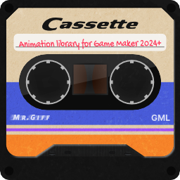

<p align="center">

</p>

# Cassette

A lightweight, self-contained GML script for creating smooth animations. Cassette provides a rich collection of standard easing functions and a simple system for building complex, chainable transitions. 

Animate anything from UI elements to character movements with just a few lines of code.

## 🚀 Quickstart Guide

### 1\. Installation

Simply add the `Cassette` script to your GameMaker project.

### 2\. Usage 
Define a Cassette manager. 
I recomnmend using 'ease' for semantic clarity i.e. ease.InOutElastic(t)

```gml
// Create Event
ease = new Cassette();
```

*Note: You can toggle between frame-based and time-based animations by setting the `CASSETTE_USE_DELTA_TIME` macro at the top of the script.*


### 3\. Animate\!

You can now start, stop, and get values from the static `ease` manager anywhere in your code.

To start a new animation, use `.transition()`. You can chain multiple tweens (tracks) together using `.add()`.

```gml
// Create Event

// Animate x to x+200, wait 30 frames, then animate back to original x
ease.transition("player_x", x, x + 200, 60, ease.OutExpo)
    .wait(30)
    .add(x + 200, x, 60, ease.InExpo);

// Animate y position with a PingPong effect that repeats 3 times
ease.transition("player_y", y, y + 100, 90, ease.OutBounce, CASSETTE_ANIM.PingPong, 3);
```
**Note:** By default (CASSETTE_AUTO_START = false), animations must be started manually. You can either call ease.play("player_x") after creating a transition or set CASSETTE_AUTO_START to true at the top of the script.

To get the current value of an animation, use `ease.get_value()`. Apply this value in a Step or Draw event.

```gml
// Step Event
ease.update(); 

// The second argument is a default value if the animation isn't active
x = ease.get_value("player_x", x);
y = ease.get_value("player_y", y);
```

## Playback Controls

You can control the playback of any active transition. Most control methods can be applied globally (e.g., ease.pause()) to affect all animations, or specifically (e.g., ease.pause("player_x")) to target just one.

State & Speed
```gml
.play([keys]) // Resumes a paused animation.

.pause([keys]) // Pauses an animation.

.stop(key) // Immediately stops and removes a specific animation.

.set_speed(speed, [keys]) // Sets the playback speed. 1.0 is normal, 2.0 is double speed, -1.0 is reverse, and etc.
```

Navigation & Seeking
```gml
.rewind([keys]) // Resets the animation to the very beginning (first track, time 0).

.ffwd([keys]) // Jumps to the very end of the entire chain.

.skip([keys]) // Skips to the start of the next track in the chain.

.back([keys]) // Jumps to the start of the previous track.

.seek(amount, [keys]) // Moves the timer by a specific amount (in frames or seconds).
```

Checking Status
```gml
.is_active(key) // Returns true if an animation with this key exists.

.is_paused(key) // Returns true if the animation is currently paused.

.get_speed(key) // Returns the current playback speed of the animation.
```

Example
```gml
// In a Step Event
ease.update(); 

// Toggle pause for "player_y"
if (keyboard_check_pressed(vk_space))
{
    if (ease.is_paused("player_y")) {
        ease.play("player_y");
    } else {
        ease.pause("player_y");
    }
}

// Set speed to reverse
if (keyboard_check_pressed(ord("R")))
{
    ease.set_speed(-1.0, "player_y");
}

// Seek forward 30 frames
if (keyboard_check_pressed(ord("S")))
{
    ease.seek(30, "player_y");
}
```

## Using Custom Curves

Cassette seamlessly integrates with GameMaker's built-in Animation Curves.

1.  Create an Animation Curve asset in your project (e.g., `ac_MyCurve`).
2.  Pass it to the `ease.custom()` method to prepare it for use.
3.  Use the result as the easing function in your transition.

<!-- end list -->

```gml
// Prepare your custom curve
var my_custom_ease = ease.custom(ac_MyCurve);

// Use it in a transition!
ease.transition("my_value", 0, 100, 120, my_custom_ease);

// Apply the value
my_variable = ease.get_value("my_value", my_variable);
```

## License

**MIT License**

Copyright (c) 2025 Mr. Giff

Permission is hereby granted, free of charge, to any person obtaining a copy of this software and associated documentation files (the "Software"), to deal in the Software without restriction, including without limitation the rights to use, copy, modify, merge, publish, distribute, sublicense, and/or sell copies of the Software, and to permit persons to whom the Software is furnished to do so, subject to the following conditions:

The above copyright notice and this permission notice shall be included in all copies or substantial portions of the Software.

THE SOFTWARE IS PROVIDED "AS IS", WITHOUT WARRANTY OF ANY KIND, EXPRESS OR IMPLIED, INCLUDING BUT NOT LIMITED TO THE WARRANTIES OF MERCHANTABILITY, FITNESS FOR A PARTICULAR PURPOSE AND NONINFRINGEMENT. IN NO EVENT SHALL THE AUTHORS OR COPYRIGHT HOLDERS BE LIABLE FOR ANY CLAIM, DAMAGES OR OTHER LIABILITY, WHETHER IN AN ACTION OF CONTRACT, TORT OR OTHERWISE, ARISING FROM, OUT OF OR IN CONNECTION WITH THE SOFTWARE OR THE USE OR OTHER DEALINGS IN THE SOFTWARE.
