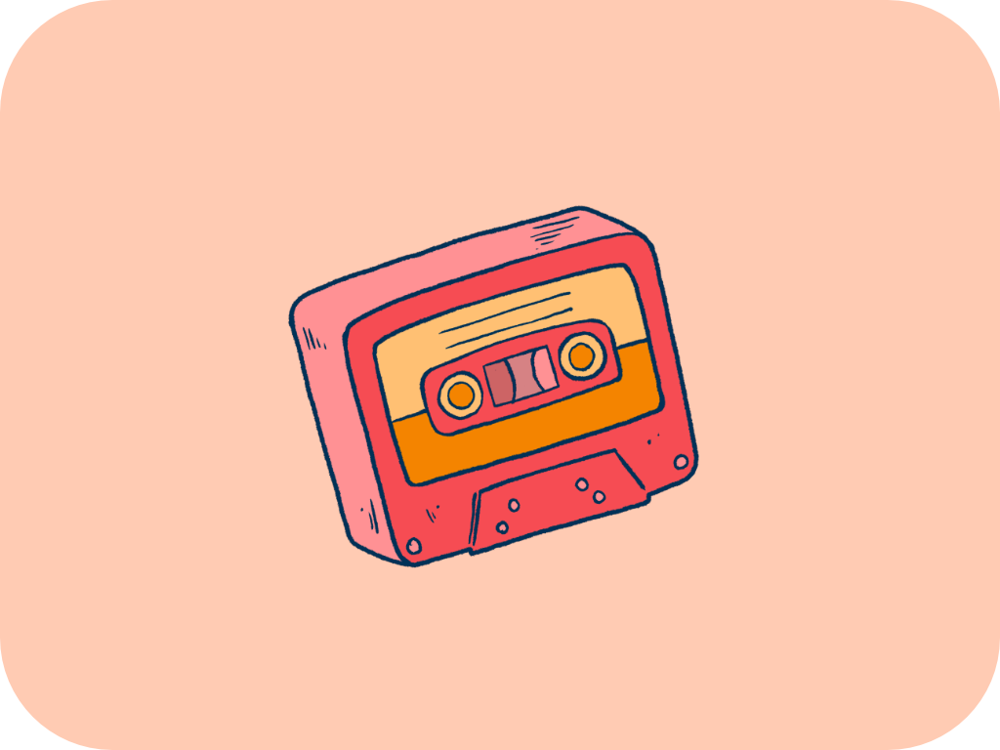

<p align="center">

</p>

# **Cassette**

Inspired by popular web tools like GSAP and Anime.js, Cassette wraps complex tweening, playback manipulation, and property binding into a simple, flexible interface.

Every animation acts like a physical cassette tape in a player, allowing you to Play, Pause, Rewind, Skip, even Seek to specific frames/seconds (and more).

Just pop a Tape in the Deck and hit play!

**New in v3.0:**

- **Decks & Tapes:** A new manager architecture (`CassetteDeck`) that holds individual animations (`Tapes`). If coming from v2.+ change your `new Cassette()` calls with `new CassetteDeck()`.
- **Cassette Handles** A new proxy class (`Cassette`) that acts as safe handle/API for defining and controlling `Tapes`.
- **Mixtapes:** GSAP-style timelines to sequence multiple tapes (including other Mixtapes) with overlaps, delays, and syncs.
- **Property Binding:** Automatically update instance variables or struct properties without writing update callbacks and bind inputs like `.duration()` to dynamic data.
- **Spring Physics:** `.react()` method for second order system (DHO) physics.
- **Jogwheel-Style Control:** `.scrub()` method (formerly `.react()` in v2+) for seeking with velocity-driven input.
- **Video Tapes:** Drive frame-perfect sprite animations using easing curves.
- **Tags** Group and control different animations together by assigning tags, e.g. `.addTag("ui")`.
- **Fully Modular** No longer a single-class god object. More maintainable and lightweight.

---

**Project Roadmap**

- **Demo & Documentation** Currently working on a demo showcasing all features as well as a dedicated static site for docs made with docsify.
- **Rhythm Game Features** A potential `.tempo()` method or likewise simple interface for syncing animations to music.
- TBA

## **Quickstart Guide**

### **1. Installation**

Download the latest .yymps release and import the `Cassette` folder to your GameMaker project.

### **2. Initialization**

Create a new **Deck** in an object Create Event. The Deck manages the lifecycle, time scale, and garbage collection of your animations.
_You can have multiple Decks (player, enemies, fx, ui, etc) but try to be sensible. You likely don't need 100+ different copies of the entire system._

```gml
// CassetteDeck([use_seconds] = false, [auto_start] = false, [time_scale] = 1.0, [default_lerp] = lerp)
anim = new CassetteDeck();

```

### **3. Basic Usage**

To animate, **insert** a tape into the deck. The API is flexible and chainable.

```gml
// Animate a value from 0 to 100 over 60 frames
slide = anim.insert("slide")
    .from(0)
    .to(100)
    .duration(60)
    .onUpdate(function(_val) {
        x = _val;
    })
    .play(); // You can start animations right away-

// -or play specfic animation later!

// Via string id or tag:
anim.play("slide")
/*
 NOTE: a string, Cassette handle returned by .insert(),
or an array of one or the other can be passed to most functions.
*/

// Via Cassette handle:
slide.play();

// Or just play all:
anim.play();

```

And that's it! Cassette will animate the value(s) provided. No need to update in the Step Event or elsewhere.

**IMPORTANT:** make sure to call `.Destroy()` on Decks you are done with in an End Game/Cleanup/Destroy event to cleanup the internal Time Source.

---

## **Core Concepts**

### **The Tape (Tweening)**

A Tape is a single animation sequence. You can chain multiple tracks together within one tape.

```gml
anim.insert("patrol")
    .fromTo({ x: 100 }, { x: 300 }) // Move Right
    .duration(60)
    .wait(20)                       // Idle
    .next()                         // Start new track (inherits previous end values)
    .to({ x: 100 })                 // Move Left
    .duration(60)
    .loopTape();                    // Repeat both tracks forever

```

### **Property Binding**

Cassette offers two powerful ways to bind data: **Output Binding** (automatically writing values) and **Input Binding** (reading dynamic parameters).

#### **1. Output Binding (Auto-Write)**

Because `insert()` defaults to the current instance, you can simply pass a struct to `.from()` or `.to()` etc. and Cassette will automatically update the matching variables on your instance. This works for structs as well.

```gml
// Bind to the current Instance (Implicit)
anim.insert("spin")
    .from({ image_angle: 0 })
    .to({ image_angle: 360 })
    .duration(60);

// Bind to a Struct
my_data = { alpha: 0, scale: 1 };

anim.insert("fade_in")
    .bind(my_data)
    .to({ alpha: 1, scale: 1.5 })
    .duration(30);

```

#### **2. Input Binding (Dynamic Parameters)**

Almost any builder method in Cassette (like `duration()`) accepts a **Struct** instead of a raw value. This creates a reference, allowing you to update the animation parameters dynamically while it is running.

```gml
slide_time = 60;

anim.insert("slide")
    .to({ x: 200 })
    .duration({slide_time})
    .play();

// Later...
slide_time = 120;

```

---

## **Cassettes (control handles)**

While you can use string keys to manage animations globally, `insert()` returns a lightweight **Cassette Handle**. You can store this in a variable to control that specific animation instance directly, without worrying about key collisions or lookups.

```gml
// Create Event
// Store the handle in a variable
my_spinner = anim.insert() // Strings aren't "required" either, and are otherwise indexed anonymously inside the system. But naming everything makes for easier debugging!
    .from({ image_angle: 0 })
    .to({ image_angle: 360 })
    .loop();

// Step Event
// Control this specific animation directly using the variable
if (keyboard_check_pressed(vk_space)) {
    if (my_spinner.isPaused()) {
        my_spinner.play();
    } else {
        my_spinner.pause();
    }
}

// You can also modify it on the fly
if (keyboard_check_pressed(vk_enter)) {
    my_spinner.setSpeed(-1.0); // Reverse it
}

```

---

## **Factories & Dynamic Construction**

Because Cassette handles are just references, you can pass them around, return them from functions, and even **add new tracks to them** after they have been defined. This allows you to create reusable animation factories and templates.

### **1. Creating a Factory**

Define a function that sets up a standard animation (like a "Pop In" effect) and returns the handle.

```gml
/// @func create_pop_in(target_instance)
function create_pop_in(_target) {
    // Insert a new tape bound to the target and return it
    return _target.anim.insert("pop_" + string(_target.id))
        .bind(_target)
        .from({ image_xscale: 0, image_yscale: 0 })
        .to({ image_xscale: 1, image_yscale: 1 })
        .duration(20)
        .ease(CassetteEase.OutBack);
}

```

### **2. Extending the Animation**

You can call the factory to get the base animation, then continue chaining methods to add more tracks.

```gml
// 1. Create the base "Pop In" animation
var _anim = create_pop_in(self);

// 2. Dynamically add a "Fade Out" sequence to the end of it
_anim.wait(60)      // Wait 1 second
     .next()        // Start a new track (inherits scale=1 from previous)
     .to({ image_alpha: 0 })
     .duration(20)
     .onEnd(function() { instance_destroy(); });

```

---

## **Advanced Features**

### **Stagger**

Play a group of animations (tapes or mixtapes) with a delay between each one. Perfect for lists, menus, or cards appearing.

```gml
// Define multiple animations
var _keys = ["btn_1", "btn_2", "btn_3"];

for(var i = 0; i < 3; i++) {
 anim.insert(_keys[i]).from(0).to(1).duration(30);
}

// Trigger them with a 5 frame delay between each
// .stagger(_targets, _amount, _reverse = false, _autoStart = false, _ease = undefined)
//      NEW features in v3.0:
//      - If _ease is undefined, _amount is the interval (delay steps/seconds) between each item.
//      - If _ease is defined, _amount is the total duration, distributing items along the curve.
//      - Change from v2.+, stagger no longer plays animations automatically.
anim.stagger(_keys, 5, false, true);

// OR Play in reverse order
// anim.stagger(_keys, 5, true, true);
```

### **Mixtapes (Timelines)**

Mixtapes allow you to group multiple Tapes together and control them as a single timeline. You can insert Tapes at specific times, absolute positions, or relative to the previous item.

```gml
var _mix = anim.mixTape("intro_sequence");

_mix.add("fade_in")           // Add a tape by its Key
    .add("logo_spin", "+=10") // Add another, starting 10 frames after fade_in ends
    .add("text_slide", "<")   // Add another, starting at the SAME time as logo_spin
    .add("subtitle", "-=15")  // Finally, add another starting 15 frames before text_slide ends
    .play();

```

### **Spring Physics (React)**

Make UI or gameplay elements feel physical using `.react()`. This uses a spring simulation (Tension/Damping) to pull a value toward a target, rather than a fixed duration.

```gml
// Create Event: Define an animation
hover_effect = Anim.insert("button_hover")
    .from(1.0)
    .to(1.5)
    .duration(100); // Duration becomes the range

// Step Event (or callback): Drive the spring physics
// If hovered, target the end (100). If not, target the start (0).
var _target_time = position_meeting(mouse_x, mouse_y, id) ? 100 : 0;

var _tension = 0.1;  // Stiffness (0.05 - 0.5)
var _damping = 0.15; // Friction  (0.05 - 0.5)

// Drive the tape handle towards the target time
hover_effect.react(_target_time, _tension, _damping);

// Retrieve the calculated value and apply it
var _val = hover_effect.get();

image_xscale = _val;
image_yscale = _val;

```

### **Jog-Wheel Control (Scrub)**

Drive an animation's playback speed based on input (velocity). Great for "scrolling" through an animation.

```gml
// Create Event
anim.insert("card_spin")
    .from({ image_angle: 0 })
    .to({ image_angle: 180 })
    .hold(); // Don't loop, just hold bounds

// Step Event
var _input = keyboard_check(vk_right) - keyboard_check(vk_left);

var _attack = 0.1;  // Acceleration speed
var _decay  = 0.05; // Deceleration (coast) speed

// .scrub(input_velocity, attack, decay)
anim.scrub("card_spin", _input, _attack, _decay);

```

### **Video Tapes (Sprite Animation)**

Control `image_index` with easing functions and durations independent of `image_speed`.

```gml
// Play 'spr_explosion' over 0.5 seconds with an Expo ease
anim.video(spr_explosion)
    .duration(0.5) // Seconds (if deck uses seconds)
    .ease(CassetteEase.OutExpo)
    .onEnd(function() { instance_destroy(); });

```

---

## **Full API Reference**

### **CassetteDeck**

The manager class responsible for creating and ticking animations.

#### **Creation**

- `insert([key], [bindTo])`: Creates a new `Cassette`.
- `mixTape(key)`: Creates or retrieves a `CassetteMixtape`.
- `video(sprite, [target])`: Creates a video tape for sprite control.
- `stagger(targets, amount, [reverse], [autoStart], [ease])`: Triggers multiple tapes with a delay/stagger.

#### **Global Controls (Affects managed Tapes)**

- `play([target], [params])`: Resumes playback.
- `pause([target])`: Pauses playback.
- `stop([target])`: Stops and resets to start.
- `rewind([target])`: Resets to time 0.
- `ffwd([target])`: Jumps to the end.
- `seek(amount, [key])`: Moves playhead by relative amount.
- `skip([target])`: Skips to next track.
- `back([target])`: Jumps to previous track.
- `eject([target])`: Destroys the tape(s).
- `scrub(target, val, att, dec, [ease])`: Jog-wheel control.
- `react(target, time, tension, damping, [snap])`: Spring physics control.
- `setSpeed(speed)`: Sets global time scale for the Deck.

#### **Getters & System**

- `get(target, [default])`: Gets the current value(s).
- `getTape(target)`: Retrieves the handle struct.
- `isPlaying([target])`: Checks if active and not paused.
- `getPlaying([filter])`: Returns array of playing handles.
- `getPaused([filter])`: Returns array of paused handles.
- `getActive([filter])`: Returns array of all active handles.
- `pauseSystem()`: Stops the Deck's internal time source.
- `resumeSystem()`: Resumes the Deck's internal time source.
- `destroy()`: Cleans up the Deck and its time source.

---

### **Cassette (The Handle)**

The struct returned by `insert()`.

#### **Builder Methods (Chainable)**

- `bind(target)`: Sets the object/struct to modify. Defaults to `other` (calling instance).
- `from(val)`: Sets start value.
- `to(val)`: Sets end value.
- `fromTo(start, end)`: Sets start and end.
- `by(amount)`: Sets end relative to start.
- `duration(frames)`: Sets duration.
- `ease(curve)`: Sets easing function/curve.
- `wait(frames)`: Adds a pause track.
- `hold()`: Clamps animation at end bounds indefinitely.
- `next()`: Starts new track segment.
- `loop([times])`: Loops current track.
- `pingpong([times])`: Ping-pongs current track.
- `loopTape([times])`: Loops entire sequence.
- `pingpongTape([times])`: Ping-pongs entire sequence.
- `startDelay(frames)`: Delays the start of the Tape.
- `add(tape, [pos], [options])`: (Mixtape) Adds a tape to timeline.
- `addTag(tag)` / `removeTag(tag)`: Manages tags.

#### **Callbacks**

- `onUpdate(func, [interval])`
- `onEnd(func)`
- `onTrackEnd(func)`
- `onAnyTrackEnd(func)`
- `onPlay(func)` / `onPause(func)` / `onStop(func)`
- `onRewind(func)` / `onFfwd(func)` / `onSeek(func)`
- `onBack(func)` / `onSkip(func)`
- `onFrame(index, func)` (for Video Tapes only)

#### **Controls & Getters**

- `play([params])`, `pause()`, `stop()`, `eject()`.
- `seek(amount)`, `rewind()`, `ffwd()`, `skip()`, `back()`.
- `scrub(...)`, `react(...)`.
- `get()`, `getName()`, `getDuration()`, `getTime()`, `getProgress()`.
- `isPlaying()`, `isPaused()`, `isFinished()`, `isInfinite()`.

---

_Cassette Illustration by Darcy-Rose Morgan_:
https://darcyrosemorganportfolio.wordpress.com/
